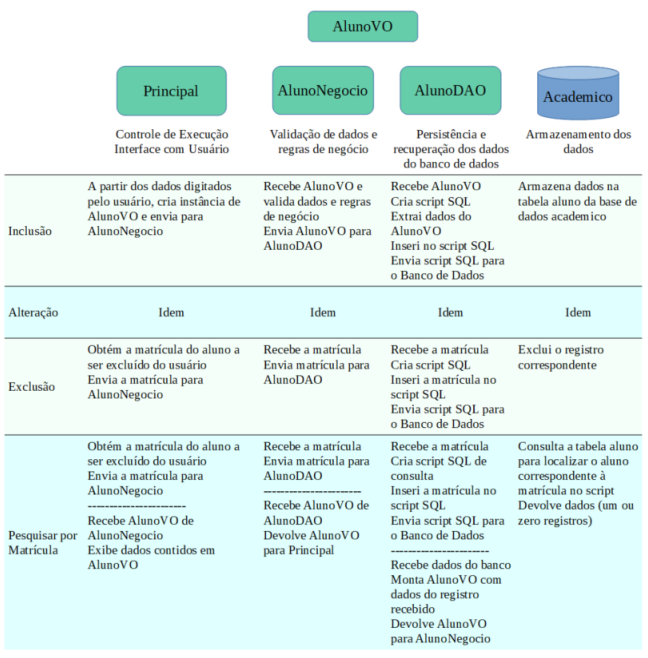

#Exercício de Manipulação de Banco de Dados com JDBC , Implementação em Camadas.

-   Apresenta uma implementação que pode ser usada como base para o desenvolvimento de
    aplicações de manipulação de informações em banco de dados. 
-   O Projeto é organizado em três camadas: **visão**, **negócio** e **persistência**. Usa uma classe VO
    para transporte de dados entre as camadas (**AlunoVO**).

# Topico 1

-   [x]  Criar uma tabela no banco **academico** com o nome: **curso** 
    
-   Campos da tabela **curso**:
    - [x] codigo - inteiro e gerado pelo banco (chave primária)
    - [x] nome - cadeia de caracteres com tamanho 50
    - [x] descricao - cadeia de caracteres com tamanho 50
    - [x] Criar uma classe **CursoVO**
    - [x] Criar uma classe **CursoDAO**[
        - [x] inclusão, 
        - [x] alteração, 
        - [x] exclusão, 
        - [x] busca por codigo
        - [x] busca por nome]
    - [x] Criar uma classe **CursoNegocio** [
        - [x] inclusão,
        - [x] alteração, 
        - [x] exclusão, 
        - [x] busca por codigo,
        - [x] busca por nome,
        - [x] validação dos dados]
-   Acrescentar no menu as opções para **Curso**

## Topico 2
-   [x] Criar uma tabela no banco **academico** com o nome: **disciplina** 
-   Campos da tabela disciplina:
    - [x] codigo - inteiro e gerado pelo banco (chave primária)
    - [x] nome - cadeia de caracteres com tamanho 50
    - [x] semestre – inteiro
    - [x] cargahoraria – inteiro
    - [x] curso – inteiro (chave estrangeira da tabela **curso**)
    - [x] Criar uma classe **DisciplinaVO**
    - [x] Criar uma classe **DisciplinaDAO**[
        - [x] inclusão, 
        - [x] alteração, 
        - [x] exclusão,
        - [x] busca por codigo,
        - [x] busca por nome]
    - [x] Criar uma classe **DisciplinaNegocio** [
        - [x] inclusão, 
        - [x] alteração, 
        - [x] exclusão, 
        - [x] busca por codigo, 
        - [x] busca por nome, 
        - [x] validação dos dados]
-   Acrescentar no menu as opções para Disciplina

### Topico 3
-   Alterar a tabela **aluno** para conter o código do **curso**, como chave estrangeira
-   Novo campo da tabela **aluno**:
- [x] curso – inteiro (chave estrangeira da tabela curso)
  
- **Alterar as funcionalidades de inclusão e alteração do aluno, para que o usuário possa escolher o curso
ao qual o aluno está vinculado.**

### Topico 4 
-  Implementar as seguintes consultas no estudo de caso de alunos, sendo que a saída dos dados pode
   ser realizada no console da aplicação, conforme listado abaixo:
  
   - Listar todos os alunos cadastrados
        - [x] matricula  
        - [x] nome   
        - [x] sexo   
   - Listar todos os cursos cadastrados
        - [x] codigo
        - [x] nome
   - Listar todos as disciplinas cadastradas
        - [x] codigo
        - [x] nome 
        - [x] semestre
        - [x] cargahoraria
   - Listar todos os alunos de um determinado curso
        - [x] codigo do curso
        - [x] nome do curso
        - [x] matricula aluno 
        - [x] nome aluno
   - Listar todas as disciplinas de um determinado curso
        - [x] codigo do curso
        - [x] nome do curso
        - [x] codigo disciplina 
        - [x] nome disciplina
   - Listar todas as disciplinas relacionadas a um aluno
        - [x] matricula aluno
        - [x] nome aluno
        - [x] codigo disciplina 
        - [x] nome disciplina
